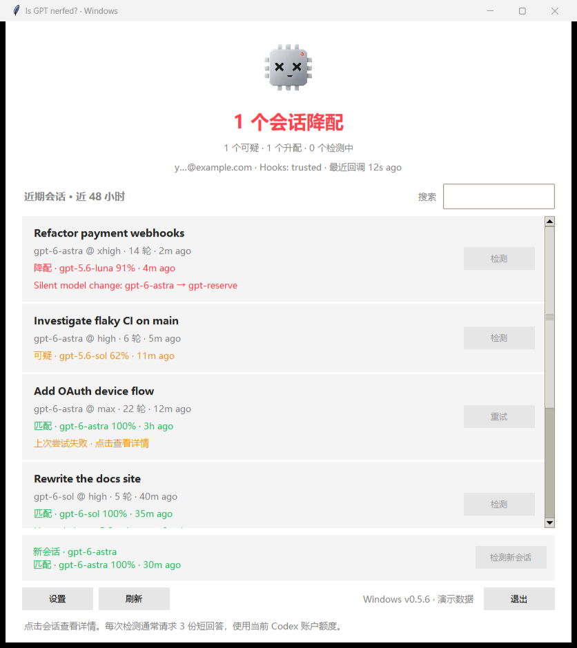

# Is GPT nerfed? — Windows

[简体中文](README.zh-CN.md) · English

Windows repository: [Giesen-Yin/Is-GPT-Nerfed-ForWindows](https://github.com/Giesen-Yin/Is-GPT-Nerfed-ForWindows).

Windows-focused fork of [kiyoakii/is-gpt-nerfed](https://github.com/kiyoakii/is-gpt-nerfed), retaining the upstream Python detector and ModelTrace attribution logic.
**macOS users: please use the original repository, [kiyoakii/is-gpt-nerfed](https://github.com/kiyoakii/is-gpt-nerfed).** This repository does not ship or maintain the original Swift app, DMG installer or macOS updater. It is a modified fork, not an unmodified mirror or an official upstream Windows release.

Current release: **0.5.3-windows** — the Windows adaptation of the 0.5.3 upstream baseline; it retains all previously developed Windows features.

## Changes from upstream

| Type | Windows fork changes |
| --- | --- |
| Added | Windows EXE/Tk UI, zh/en switching, tray residency, in-app hook installation/trust/diagnostics and isolated Windows tests. |
| Changed | Windows process discovery/locking/notifications, UTF-8 hook launchers and source fallback, Python 3.11+ source support, portable packaging and manual updates. |
| Removed | Swift/macOS app, DMG and shell installers, macOS self-updater and unused Unix terminal menu implementation. |
| Preserved | Original MIT notice, upstream attribution, ModelTrace bank/provenance/calibrated prompts, scorer and its JavaScript parity tests. |

Based on upstream commit [`ff0d7c0c8fdc8713273b6570b1ada1838eaad84c`](https://github.com/kiyoakii/is-gpt-nerfed/commit/ff0d7c0c8fdc8713273b6570b1ada1838eaad84c).
See the [Windows changelog and retained upstream history](CHANGELOG.md), [development requirements](docs/DEVELOPMENT.md),
and [upstream standards review](docs/UPSTREAM_REVIEW.md). Windows release numbers describe this fork; they do not imply upstream endorsement.



## Run on Windows

Use Windows 10/11 x64 and an installed, signed-in Codex with plugin hook support. Download this fork's Windows ZIP, extract the **whole folder**, and open `IsGPTNerfed.exe`. Keep `nerfed-backend.exe` and `_internal` beside it. No separate Python installation or administrator elevation is required for the portable app. Unsigned executables may be blocked by SmartScreen or organizational policy; do not disable security controls.

For source use, install Python 3.11+ including Tk, then run:

```powershell
.\windows\start.ps1
# Or: python windows/app.py
```

The GUI lists recent conversations from the local Codex database. Search by title/model/ID and click **Probe** to test a selected conversation through an ephemeral fork; no chat skill invocation is needed. Click a card for its report. Deleted or archived conversations are hidden by default; enable their display in Settings to inspect retained history. Deleted/unavailable records cannot be probed.

## Settings and background behavior

- Switch **Simplified Chinese / English** in Settings; saving changes updates the UI. User titles, model IDs, reasoning identifiers, stored evidence and external diagnostics remain unchanged.
- Drag the title bar to move the window; drag the edges to resize it. Long session text wraps and lists scroll.
- **Keep running in background when closed** defaults off. When enabled, closing hides the window in the Windows notification area; click the tray icon to restore, or right-click for Open / Settings / Quit. If tray creation fails, the window stays visible. **Quit** exits the UI; already-started probes are not cancelled.
- **Auto** mode launches due probes. The app checks the scheduling heartbeat once per minute while open or in the tray; hooks also check after turns. **Remind only** mode displays due reminders without launching model inference. UI reminders are limited to one per session per 15 minutes. Saving Remind only also sets fresh-session frequency to manual for compatibility with older installed hooks.
- Session frequency defaults to `30m`; `manual`, time intervals and `turns:8` are available. Fresh-session probing defaults to `manual` and uses a time interval when enabled. In the UI heartbeat, fresh-session inference also requires Auto mode.
- Notifications, match notifications and sound are configurable. **Test notification** sends a test message, not a verdict; it respects the notification switch and Windows notification/Do Not Disturb settings.

A normal probe requests three short model responses under your account; timeout/transport retries may use additional responses. Match is silent by default. Results are statistical attributions among the models in the bundled bank, **not proof of the server's actual weights**. A missing/failed/unlisted probe is not evidence of downgrade. Settings changes in Codex may require user confirmation to interpret.

## Install and diagnose Codex hooks inside the app

The EXE can browse and manually probe **without preinstalled hooks**. Hooks add passive scans, in-chat reminders,
and scheduling triggered by Codex conversation events after the frontend exits; they are not a standalone Windows timer service.

1. Open **Codex plugin** in the app (also linked from the first-run banner).
2. **Run diagnostics** to check Codex, the fingerprint bank, plugin enablement, five hook definitions/trust, and the standalone runtime.
3. Click **Install / update hooks**. Explicitly select “Also trust this plugin’s five hooks after installation” for a single operation, or use **Trust installed hooks** afterwards.
4. Restart Codex, send a message, and run diagnostics again to confirm actual hook events.
5. If Codex is not found, use **Choose codex.exe** and retry. This does not install Codex itself.

No separate install.ps1 invocation or system Python is needed. The portable app stages a standalone runtime and
local marketplace at `NERFED_HOME/windows-runtime/<version-content-hash>/`, then registers through the Codex CLI.
Installed hooks keep working after the portable frontend is closed, moved or removed. Old runtime versions are
retained for hooks that have not reloaded yet.

Installation preflights Codex/app-server and reports failures. A failed registration attempts to restore this plugin's
previous registration through Codex rather than overwriting unrelated settings. Only the five exact generated hook
commands can be trusted through this flow. Installation and trust are never performed silently on startup.

`install.ps1` / `uninstall.ps1` remain source-maintenance alternatives. Source installation needs Python; portable
EXE installation does not. Upgrading the GUI does not silently update hooks; click Install / update again when needed.

## Data and updates

Codex state is read from `CODEX_HOME` (default `%USERPROFILE%\.codex`). Results/settings are stored in `NERFED_HOME` (default `CODEX_HOME\is-gpt-nerfed`); `windows-ui.json` holds language/background preferences. Auth is read only to derive an account hash and masked label. The app does not upload the ledger; actual probes are normal Codex inference requests. Closing the app does not delete data.

Automatic app updates are disabled: this fork must not install upstream macOS assets. Replace the extracted Windows folder manually after quitting the app. The GUI, backend, EXE file/product version and ZIP name share the plugin manifest version. See [Windows usage/build guide](windows/README.md) and [development requirements](docs/DEVELOPMENT.md).

## Credits

[kiyoakii/is-gpt-nerfed](https://github.com/kiyoakii/is-gpt-nerfed) and its contributors for the original project, detection backend, plugin architecture and interface design that this Windows fork builds on;
[ModelTrace](https://github.com/xqy2006/ModelTrace) (xqy2006, MIT) for the fingerprint bank, scorer, calibrated prompts and fork-and-verify sequence;
[hlwy-ai-checker](https://github.com/hanlinwenyuan/hlwy-ai-checker) for the random-number probing idea;
[simple-term-menu](https://github.com/IngoMeyer441/simple-term-menu) (MIT) for the original project's terminal session picker (replaced by a Windows-compatible selector here).

Thanks also to [OpenAI Codex](https://developers.openai.com/codex/) for its contributions to the Windows adaptation, frontend implementation, debugging, automated tests, code review, documentation and release preparation.

## License and attribution

Project code, including Windows modifications, is **MIT**; the original copyright notice is retained in [LICENSE](LICENSE). See [THIRD_PARTY_NOTICES.md](THIRD_PARTY_NOTICES.md) for upstream, ModelTrace and bundled component credits. Runtime dependencies retain their own licenses; this project does not relicense them. [ModelTrace provenance](plugin/assets/modeltrace/provenance.json), its bank and calibrated prompts are preserved.
